# How to run outcome-wide analysis:

As an online companion to the manuscript "Beyond the single-outcome approach: a comparison of outcome-wide analysis methods for exposome research" by Anguita-Ruiz et al. (2023), we have created this GitHub repository where we provide **scripts** and a **simulated multivariate dataset** for running **outcome-wide analysis**. 

Outcome-wide analysis can offer several benefits, including increased power to detect weak signals and the ability to identify exposures with multiple effects on health, which may be good targets for preventive measures. Recently, advanced statistical multivariate techniques for outcome-wide analysis have been developed, but they have been rarely applied to exposome analysis. In this work, we provide an overview of six methods that are well-suited for outcome-wide exposome analysis and are implemented in the R statistical software. The identified methods can be grouped into four main categories: regularized multivariate regression techniques, multi-task learning approaches, dimensionality reduction approaches, and Bayesian extensions of the multivariate regression framework.  

In **this repository**, we cover all required steps for applying these techniques; including data standardization, model parameters calibration, output curation strategies and visualization. 


## Set R environment 


```r
rm(list=ls())

list.of.packages <- c(
  "rrpack","groupRemMap","gflasso","MBSP","RMTL","ggplot2","scales","devtools","corrplot","pheatmap","RColorBrewer","viridis","foreach","Matrix","MASS","parallel","doParallel","utils","nortest","ranger","palmerpenguins","tidyverse","kableExtra","haven","klaR","faraway","corrplot","ggcorrplot"
)
new.packages <- list.of.packages[!(list.of.packages %in% installed.packages()[,"Package"])]
if(length(new.packages) > 0){
  install.packages(new.packages, dep=TRUE)
}
for(package.i in list.of.packages){ #loading packages
  suppressPackageStartupMessages(
    library(
      package.i, 
      character.only = TRUE
    )
  )
}

options(max.print=100000)

print("Required R libraries successfully loaded")
```

```
[1] "Required R libraries successfully loaded"
```


## Defining working directory and loading required functions.


```r
setwd(here::here())
getwd()
```

```
[1] "/home/aanguita@isglobal.lan/Escritorio/Github_project_outcomewideanalysis/GITHUB_PROJECT/exposome_outcomewide"
```

```r
source("./source/source.R")
```


##  Generating a simulated dataset with multiple exposures, confounders and outcomes


```r
# Simulate multivariate dataset with 1000 individuals, 80 exposures, 10 confounders and 10 outcomes (only continuous)
n = 1000 # number of individuals
p = 80 # number of exposures
p0 = 10 # number of true predictors
q = 10 # number of outcomes
q0 = 7 # number of associated outcomes
c = 10 # number of confounders
#s2n refers to signal to noise ratio
#sigma  refers to error variance. If specfied, then s2n has no effect
#rho_X  refers to correlation parameter in the generation of predictors
#rho_E  refers to correlation parameter in the generation of random errors
simdata <- sim_mdata(n = n, p = p, p0 = p0, q = q, q0 = q0, c = c, nrank = 4, s2n = 1, sigma = NULL, rho_X = 0.2, rho_E = 0, rho_C = 0)

# Outcome data
dim(simdata$Y) 
```

```
[1] 1000   10
```

```r
# Exposure and confounders data (the last c columns correspond to confounders)
dim(simdata$X)
```

```
[1] 1000   90
```

```r
# Multiple outcomes Matrix (no missings), we select only the 5 continuous outcomes
corrAll <- cor(cbind(simdata$X,simdata$Y))
p.mat <- cor_pmat(simdata$X)
corrplot(corrAll, tl.cex = 0.4)
```

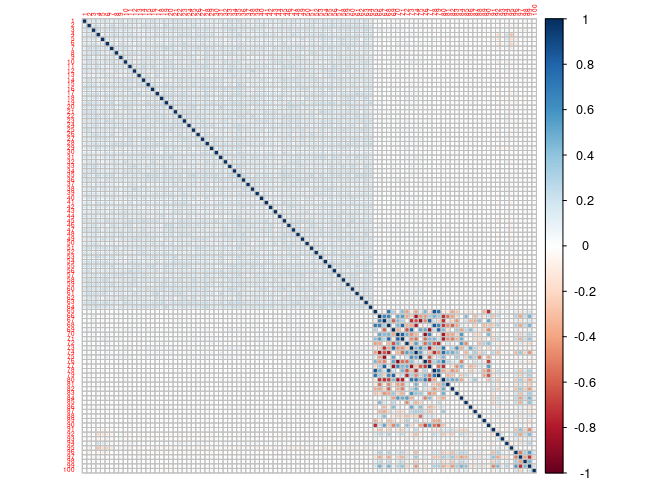<!-- -->

```r
# Multiple outcomes Matrix (no missings)
Y <- simdata$Y
# Multiple exposures and confounders Matrix (no missings)
X <- simdata$X # The last c predictors will be treated as confounders in further analyses
```


## Preparing data for analysis                                      


```r
# First, we need to scale and center the three datasets
Y_scaled <- as.matrix(scale(Y,center = T, scale = T))
X_scaled <-  as.matrix(scale(X,center = T, scale = T))
colnames(X_scaled) <- paste0("X",1:(p+c))
colnames(Y_scaled) <- paste0("Y",1:(q))
```


## Running outcome-wide analyses   

### GFLasso


```r
# Cross validation for the identification of optimal hyperparameters
testCV <- cv_gflasso(X = X_scaled, Y = Y_scaled, params = c(seq(0.1,0.9,length=5),exp(seq(log(1), log(20), length=10))), R=cor(Y_scaled)**2, nCores = 16, covar=c((p+1):(p+c)))
```

```
[1] 1.088294 1.094243 1.096339 1.082441 1.089824
```

```r
# Heatmap for RMSE
cv_plot_gflasso(testCV)
```

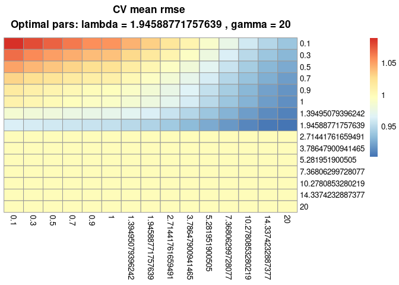<!-- -->


```r
# Optimal hyperparameters
testCV$optimal
```

<div data-pagedtable="false">
  <script data-pagedtable-source type="application/json">
{"columns":[{"label":[""],"name":["_rn_"],"type":[""],"align":["left"]},{"label":["lambda"],"name":[1],"type":["dbl"],"align":["right"]},{"label":["gamma"],"name":[2],"type":["dbl"],"align":["right"]}],"data":[{"1":"1.945888","2":"20","_rn_":"218"}],"options":{"columns":{"min":{},"max":[10]},"rows":{"min":[10],"max":[10]},"pages":{}}}
  </script>
</div>

```r
# Run the final model
gfMod <- gflasso(Y = Y_scaled, X = X_scaled, R=cor(Y_scaled)**2, opts = list(lambda = testCV$optimal$lambda,gamma = testCV$optimal$gamma), covar=c((p+1):(p+c)))

# Matrix of coefficients
head(gfMod$B)
```

```
              Y1          Y2          Y3           Y4          Y5            Y6
X1  0.0009718142 -0.02267170 -0.01359985 -0.004907957  0.02114222  0.0009691244
X2 -0.0235333584 -0.01468349 -0.02523898  0.046759445 -0.04684416 -0.0434870909
X3  0.0621750430  0.08977081  0.06026830 -0.037079340  0.06721505  0.0322033294
X4 -0.0499495947 -0.19184880 -0.09240604  0.211022341 -0.28009041 -0.0499521324
X5 -0.0423623256 -0.19088207 -0.08096438  0.139389442 -0.14823164 -0.1223713568
X6 -0.0256268072 -0.10857204 -0.09791108  0.098481623 -0.22007221 -0.0889802183
             Y7           Y8            Y9          Y10
X1 -0.015455034 -0.033362326 -1.549441e-02  0.008296876
X2 -0.014676028 -0.014680802 -1.467332e-02  0.000000000
X3 -0.017240806  0.063628834  1.425495e-02  0.027232016
X4  0.063318123 -0.011817623 -1.250565e-02 -0.024504629
X5  0.009266275  0.009260949  6.651562e-05  0.017359259
X6  0.001200193  0.010761660 -7.506566e-03  0.001200836
```

```r
rownames(gfMod$B) <- paste0("X",1:(p+c))
colnames(gfMod$B) <- paste0("Y",1:(q))

# Remove confounders from output coefficient matrix
gfMod$B <- gfMod$B[-which(rownames(gfMod$B) %in% colnames(X_scaled)[c((p+1):(p+c))]),]

# Density plot of beta coefficients
ggplot(data.frame(values = as.numeric(gfMod$B)), aes(values)) + geom_density(bw = "SJ")
```

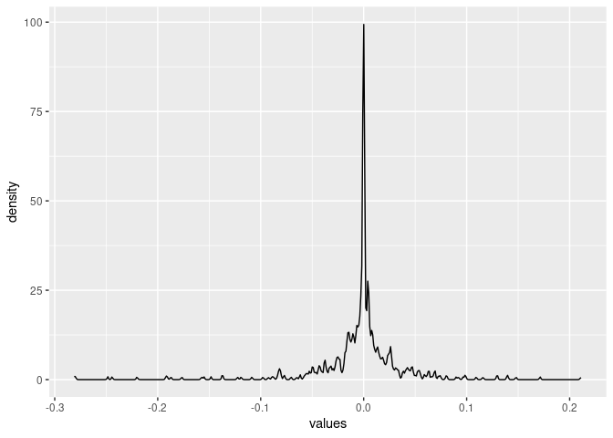<!-- -->


```r
#-- Plotting outputs: Heatmap of beta coefficients --#
# Function for identifying the breaks for generating N equal size groups of beta values
quantile_breaks <- function(xs, n = 10) {
  breaks <- quantile(xs, probs = seq(0, 1, length.out = n))
  breaks[!duplicated(breaks)]
}
mat_breaks <- quantile_breaks(gfMod$B, n = 7)
mat_breaks <- c(mat_breaks[c(1:3)],-0.00000000000000000000001,0,mat_breaks[c(5:length(mat_breaks))])
table(gfMod$B == 0)
```

```

FALSE  TRUE 
  753    47 
```

```r
table(cut(as.numeric(gfMod$B), breaks=mat_breaks))
```

```

  (-0.281,-0.0178] (-0.0178,-0.00397]  (-0.00397,-1e-23]         (-1e-23,0] 
               133                133                134                 47 
       (0,0.00366]   (0.00366,0.0178]     (0.0178,0.211] 
                85                133                134 
```

```r
# Select exposures with a beta coefficient above the 50 perc in at least 60 % of the outcomes
getPercBeta <- function (x,p) { 
  object <- c((as.numeric(quantile(abs(x[which(x<0)]),c(p)))*-1),as.numeric(quantile(x[which(x>0)],c(p))))
  return(object)
}
THRESHOLD_BETA <- apply(gfMod$B,2,getPercBeta,0.5)
THRESHOLD_BETA_Pmean <- apply(THRESHOLD_BETA,1,mean)
check_betas <- function (x) {
  (length(which((x > THRESHOLD_BETA_Pmean[2]) | (x < THRESHOLD_BETA_Pmean[1])))*100)/ncol(gfMod$B) > 60
}
sel_exp <- names(which(apply(gfMod$B,1,check_betas)))
gfMod_filter <- gfMod$B[sel_exp,]
# Heatmap
pheatmap(gfMod_filter, fontsize = 6, fontsize_row = 6, cluster_rows = T, cluster_cols = F, border_color=NA,color = rev(brewer.pal(11, "RdYlGn")[3:9]),breaks = mat_breaks, main="GFLasso_model")
```

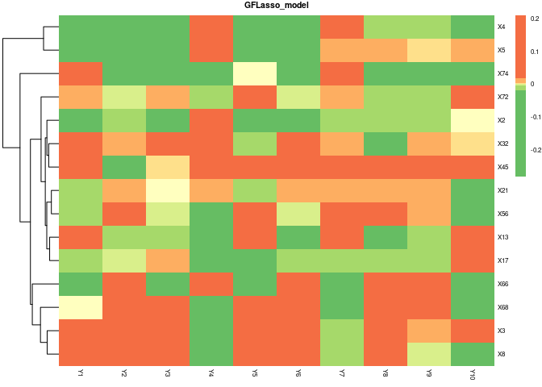<!-- -->

```r
#----#
```

### GroupRemMap


```r
#Creation of matrix for covariates escaping from lambda penalty (confounders)
C=matrix(1, ncol(X_scaled), ncol(Y_scaled))
rownames(C) <- colnames(X_scaled)
colnames(C) <- colnames(Y_scaled)
C[c((p+1):(p+c)),] <- rep(2,ncol(C))

#-- Cross validation for the identification of optimal hyperparameters --#
lamL1.v=exp(seq(log(1), log(15), length=10))
lamL2.v=seq(1, 20, length=10)
# GroupRemMap allows the user to define a grouping structure in the predictors.
# The grouping structure can be defined by the user based on expert knowledge or retrieved from the data (e.g., identifying groups of highly correlated variables)
# Here we will use a function to identify groups of highly correlated variables
res <- klaR::corclust(X_scaled, cl = NULL, method = "complete")
```

```
No factor variables in x, Cramer's V not used.
```

```r
plot(res, mincor = 0.6)
```

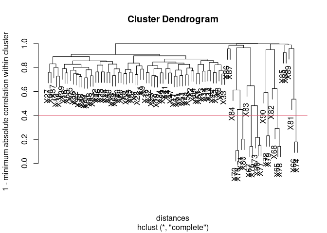<!-- -->

```r
G <- cutree(res$cluster.numerics, k = 17)
```


```r
# Run CV model (this process can take long computing times (more than 1 hour depending on the cpu resources))
# CV_model_grouprem <- group.remmap.cv( X = X_scaled, Y = Y_scaled, G = G, lam1.v=lamL1.v, lam2.v=lamL2.v, C.m=C, fold=5, seed=c(12345))
# min(CV_model_grouprem$ols.cv)
# min(CV_model_grouprem$rss.cv)
# save(CV_model_grouprem,file="./CV_model_grouprem.RData") 
# NOTE: IF THE PROCESS ABOVE IS RUNNING LOW, YOU CAN DIRECTLY LOAD THE MODEL FROM HERE.
load("./source/CV_model_grouprem.RData")

# Use CV based on Unshrinked estimator (ols.cv)
# Find the optimal (LamL1,LamL2) based on the cv score
pick=which.min(as.vector(CV_model_grouprem$ols.cv))
lamL1.pick=CV_model_grouprem$l.index[1,pick]
lamL2.pick=CV_model_grouprem$l.index[2,pick]
#----#

# Run the final model with optimal hyperparameters
GrmMod <- group.remmap( X = X_scaled, Y = Y_scaled, G = G, lam1=lamL1.pick, lam2=lamL2.pick, phi0=NULL, C.m=C)
rownames(GrmMod$phi) <- colnames(X_scaled)
colnames(GrmMod$phi) <- colnames(Y_scaled)

# Remove confounders from output coefficient matrix
GrmMod$phi <- GrmMod$phi[-which(rownames(GrmMod$phi) %in% colnames(X_scaled)[c((p+1):(p+c))]),]

# Density plot of beta coefficients
# ggplot(data.frame(values = as.numeric(GrmMod$phi)), aes(values)) + geom_density(bw = "SJ")
toplot <- as.numeric(unlist(as.data.frame(GrmMod$phi)))
hist((y=toplot),breaks = 45)
```

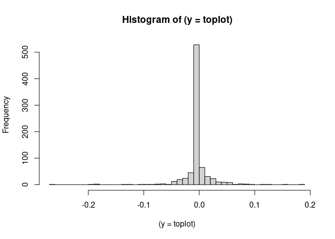<!-- -->


```r
#-- Plotting outputs: Heatmap of beta coefficients --#
# Function for identifying the breaks for generating N equal size groups of beta values
quantile_breaks <- function(xs, n = 8) {
  breaks <- quantile(xs, probs = seq(0, 1, length.out = n))
  breaks[!duplicated(breaks)]
}
mat_breaks_neg <- quantile_breaks(GrmMod$phi[which(GrmMod$phi<0)], n = 3)
mat_breaks_pos <- quantile_breaks(GrmMod$phi[which(GrmMod$phi>0)], n = 3)
mat_breaks <- c(mat_breaks_neg,-0.000000000000001,0,1e-05,mat_breaks_pos)
table(cut(as.numeric(GrmMod$phi), breaks=mat_breaks))
```

```

   (-0.262,-0.0149] (-0.0149,-0.000268]  (-0.000268,-1e-15]          (-1e-15,0] 
                 87                  88                   0                 467 
          (0,1e-05]    (1e-05,0.000129]   (0.000129,0.0142]      (0.0142,0.189] 
                  0                   1                  78                  78 
```

```r
# Select exposures with a beta coefficient different from 0 in at least 60 % of the outcomes
getPercBeta <- function (x,p) { 
  object <- c((as.numeric(quantile(abs(x[which(x<0)]),c(p)))*-1),as.numeric(quantile(x[which(x>0)],c(p))))
  return(object)
}
THRESHOLD_BETA <- apply(GrmMod$phi,2,getPercBeta,0.0000001)
THRESHOLD_BETA_Pmean <- apply(THRESHOLD_BETA,1,mean)
check_betas <- function (x) {
  (length(which((x > THRESHOLD_BETA_Pmean[2]) | (x < THRESHOLD_BETA_Pmean[1])))*100)/ncol(GrmMod$phi) > 60
}
sel_exp <- names(which(apply(GrmMod$phi,1,check_betas)))
GrmMod_filter <- GrmMod$phi[sel_exp,]
# Heatmap
pheatmap(GrmMod_filter, fontsize = 6, fontsize_row = 6, cluster_rows = T, cluster_cols = F, border_color=NA,color = rev(brewer.pal(11, "RdYlGn")[3:9]),breaks = mat_breaks, main="GroupRemMap_model")
```

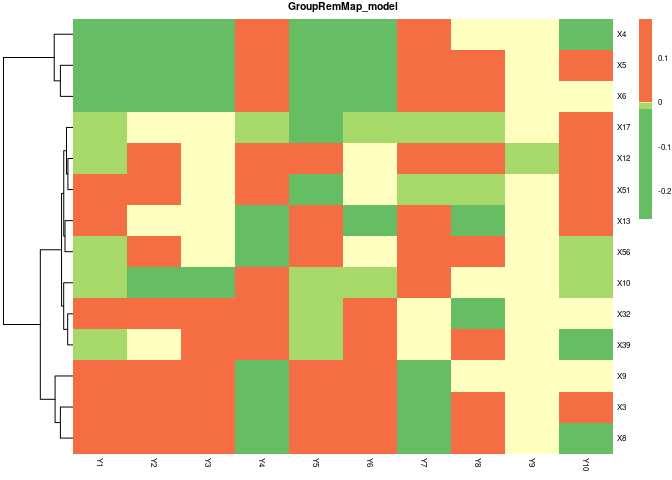<!-- -->

```r
#----#
```

### MTL_L21


```r
# Setting up the parallelization process (IMPORTANT: Only for ubuntu computers)
parallel::detectCores()
```

```
[1] 16
```

```r
n.cores <- parallel::detectCores() - 1
my.cluster <- parallel::makeCluster( # create the cluster
  n.cores, 
  type = "PSOCK"
)
print(my.cluster) # check cluster definition (optional)
```

```
socket cluster with 15 nodes on host 'localhost'
```

```r
doParallel::registerDoParallel(cl = my.cluster) # register it to be used by %dopar%
foreach::getDoParRegistered() # check if it is registered (optional)
```

```
[1] TRUE
```

```r
foreach::getDoParWorkers() # how many workers are available? (optional)
```

```
[1] 15
```

```r
#-- Perform the cross validation for the identification of optimal Hyperparameters --#
dataX <- X_scaled
dataY <- Y_scaled
# Create a different object for confounders
C <- X_scaled[,c((p+1):(p+c))]
# Remove confounders from the predictors
dataX <- dataX[,-c((p+1):(p+c))]
# Residualization of Xs for confounders adjustment
dataRES <- cbind(dataX,C)
new_data_dataX <- dataX
for (j in 1:ncol(dataX)) {
  f <- as.formula(paste(colnames(dataRES)[j]," ~ .",sep=""))
    resglm <- glm( f, family = gaussian, data=as.data.frame(dataRES[,c(j,(ncol(dataX)+1):ncol(dataRES))]))
    new_data_dataX[,j] <- resglm$residuals
}
# Residualization of Ys for confounders adjustment
dataRES <- cbind(dataY,C)
new_data_dataY <- dataY
for (j in 1:ncol(dataY)) {
  f <- as.formula(paste(colnames(dataRES)[j]," ~ .",sep=""))
  resglm <- glm( f, family = gaussian, data=as.data.frame(dataRES[,c(j,(ncol(dataY)+1):ncol(dataRES))]))
  new_data_dataY[,j] <- resglm$residuals
}
dataY <- new_data_dataY
dataX_f <- do.call("list", replicate(ncol(dataY), new_data_dataX, simplify = FALSE))
dataY_f <- list()                   # Create empty list
for(k in 1:ncol(dataY)) {             # Using for-loop to add columns to list
  dataY_f[[k]] <- as.matrix(dataY[ , k])
}
names(dataY_f) <- colnames(dataY)
# Running CV MTL model
cvfit <- cvMTL(dataX_f, dataY_f, type="Regression", Regularization="L21",
             Lam2=0, opts=list(init=0, tol=10^-6, maxIter=1500), nfolds=5,
             stratify=F, Lam1_seq=c(seq(0.1,0.9,length=5),exp(seq(log(1), log(20), length=10))))
#plot the CV accuracies across lam1 sequence
plot(cvfit)
```

<!-- -->

```r
cvfit$Lam1.min
```

```
[1] 0.1
```

```r
#----#
```


```r
# Run final model in the whole dataset with optimal hyperparameters
MTL21model <- par_boostrapping_MTL(x = X_scaled,y = Y_scaled,lam=cvfit$Lam1.min,covars=colnames(X_scaled)[c((p+1):(p+c))],wholedataset=TRUE) #to get more details on this in-house function, please, visit the source.R file
dim(MTL21model$W)
```

```
[1] 80 10
```

```r
rownames(MTL21model$W) <- colnames(X_scaled)[-c((p+1):(p+c))]
colnames(MTL21model$W) <- colnames(Y_scaled)

# Density plot of beta coefficients
toplot <- as.numeric(unlist(as.data.frame(MTL21model$W)))
hist((y=toplot), breaks = 45)
```

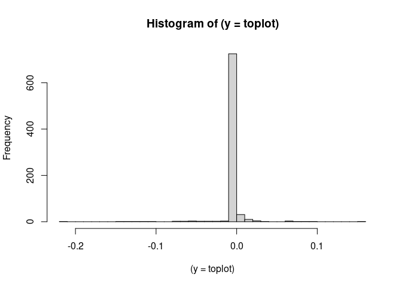<!-- -->


```r
#-- Plotting outputs: Heatmap of beta coefficients --#
# Function for identifying the breaks for generating N equal size groups of beta values
quantile_breaks <- function(xs, n = 8) {
  breaks <- quantile(xs, probs = seq(0, 1, length.out = n))
  breaks[!duplicated(breaks)]
}
mat_breaks_neg <- quantile_breaks(MTL21model$W[which(MTL21model$W<0)], n = 3)
mat_breaks_pos <- quantile_breaks(MTL21model$W[which(MTL21model$W>0)], n = 3)
mat_breaks <- c(mat_breaks_neg,-0.000000000000001,0,1e-05,mat_breaks_pos)
table(cut(as.numeric(MTL21model$W), breaks=mat_breaks))
```

```

   (-0.213,-0.00341] (-0.00341,-2.55e-05]   (-2.55e-05,-1e-15] 
                  33                   33                    0 
          (-1e-15,0]            (0,1e-05]     (1e-05,2.66e-05] 
                 680                    0                    1 
  (2.66e-05,0.00569]      (0.00569,0.159] 
                  26                   26 
```

```r
# Select exposures with at least one beta coefficient different from zero
list_active_pred <-  which(apply(MTL21model$W,1, function(x){ any(!x  == 0)}))
sel_exp <- rownames(MTL21model$W)[list_active_pred]
filter_MTL21model <- MTL21model$W[sel_exp,] # FIRST SELECTION: BASED ON SELECTING FEATURES WITH B != 0
# Heatmap
pheatmap(filter_MTL21model, fontsize = 6, fontsize_row = 6, cluster_rows = T, cluster_cols = F, border_color=NA,color = rev(brewer.pal(11, "RdYlGn")[c(3:9)]),breaks = mat_breaks, main="MTL_L21_model")
```

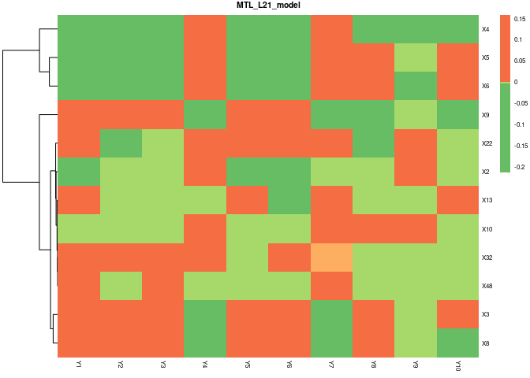<!-- -->

```r
#-- --#
```


### sRRR 


```r
# Matrix of outcomes
Y <- Y_scaled
# Matrix of input predictors
X <- X_scaled

# Definition of lambda sequence
lamseq <- c(seq(0.1,0.9,length=5),exp(seq(log(1), log(20), length=10)),25,30,35,40,45,55,65,75)

# Identification of optimal Rank
fitCV <- rep(NA,5)
for (k in 1:5) {
  time <- Sys.time()
  ##  weight=0 for confounders to ensure no penalty    
  WA = 1-as.numeric(colnames(X) %in% colnames(X_scaled)[c((p+1):(p+c))])
  fit.cv.srrr <-  cv.srrr(
    Y,
    X,
    nrank = k, 
    modstr = list(lamA=lamseq, nlam=length(lamseq), WA=WA))
  print(paste("CV Model for rank:",k))
  print(fit.cv.srrr$cverror)
  print(Sys.time() - time) 
  fitCV[k] <- fit.cv.srrr$cverror
  
}
```

```
[1] "CV Model for rank: 1"
[1] 7235.989
Time difference of 2.96507 secs
[1] "CV Model for rank: 2"
[1] 6796.524
Time difference of 6.111448 secs
[1] "CV Model for rank: 3"
[1] 6851.335
Time difference of 17.81375 secs
[1] "CV Model for rank: 4"
[1] 6862.618
Time difference of 21.61796 secs
[1] "CV Model for rank: 5"
[1] 6916.095
Time difference of 28.06978 secs
```

```r
# Create scree plot
library(ggplot2)
qplot(c(1:5), fitCV) + 
  geom_line() + 
  xlab("Rank") + 
  ylab("CV error") +
  ggtitle("Scree Plot") 
```

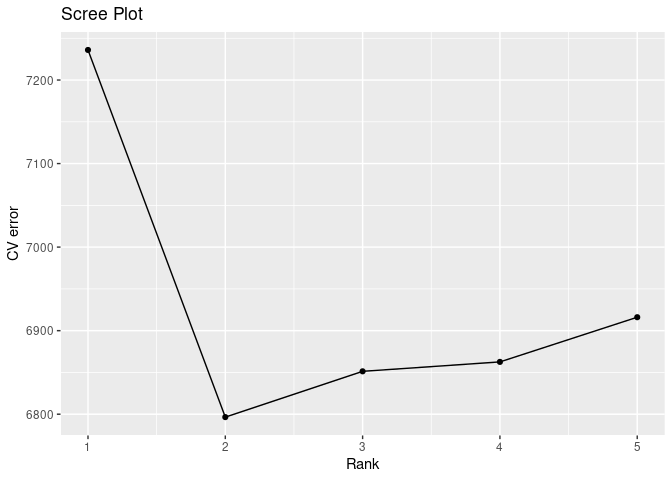<!-- -->


```r
# Optimal rank 
k = 2

# Definition of confounders
WA = 1-as.numeric(colnames(X) %in% colnames(X_scaled)[c((p+1):(p+c))])

# Fit final model
fit.cv.srrr <-  cv.srrr(
  Y,
  X,
  nrank = k, 
  modstr = list(lamA=lamseq, nlam=length(lamseq), WA=WA))

# Optimal lambda
fit.cv.srrr$lambda[fit.cv.srrr$minid]
```

```
[1] 25
```

```r
# Density plot of beta coefficients
toplot <- as.numeric(unlist(as.data.frame(fit.cv.srrr$coef)))
hist((y=toplot), breaks = 45)
```

<!-- -->

```r
# Selecting estimated coefficients
coef_matrix_df <- as.data.frame(fit.cv.srrr$coef)
rownames(coef_matrix_df) <- colnames(X_scaled) 
names(coef_matrix_df) <- colnames(Y_scaled)

# Remove confounders from output coefficient matrix
coef_matrix_df <- coef_matrix_df[-which(rownames(coef_matrix_df) %in% colnames(X_scaled)[c((p+1):(p+c))]),]
```


```r
#-- Plotting outputs: Heatmap of beta coefficients --#
# Function for identifying the breaks for generating N equal size groups of beta values
quantile_breaks <- function(xs, n = 8) {
  breaks <- quantile(xs, probs = seq(0, 1, length.out = n))
  breaks[!duplicated(breaks)]
}
mat_breaks <- quantile_breaks(fit.cv.srrr$coef, n = 10)
mat_breaks <- c(mat_breaks[c(1:3)],-0.00000000000000000000000000000000001,0.00000000000000000000000001,mat_breaks[c(4:6)])
table(fit.cv.srrr$coef == 0)
```

```

FALSE  TRUE 
  470   430 
```

```r
table(cut(as.numeric(fit.cv.srrr$coef), breaks=mat_breaks))
```

```

   (-0.412,-0.0103] (-0.0103,-0.000888]  (-0.000888,-1e-35]          (-1e-35,0] 
                 99                 100                  41                 430 
          (0,1e-26]    (1e-26,0.000706]  (0.000706,0.00603] 
                  0                  29                 100 
```

```r
# Select exposures with a beta coefficient above the 50 percentile in at least 60 % of the outcomes
getPercBeta <- function (x,p) { 
  object <- c((as.numeric(quantile(abs(x[which(x<0)]),c(p)))*-1),as.numeric(quantile(x[which(x>0)],c(p))))
  return(object)
}
THRESHOLD_BETA <- apply(coef_matrix_df,2,getPercBeta,0.50)
THRESHOLD_BETA_Pmean <- apply(THRESHOLD_BETA,1,mean)
check_betas <- function (x) {
  (length(which((x > THRESHOLD_BETA_Pmean[2]) | (x < THRESHOLD_BETA_Pmean[1])))*100)/ncol(coef_matrix_df) > 60
}
sel_exp <- names(which(apply(coef_matrix_df,1,check_betas)))
sRRRmodel_filter <- coef_matrix_df[sel_exp,]
# Heatmap
pheatmap(sRRRmodel_filter, fontsize = 6, fontsize_row = 6, cluster_rows = T, cluster_cols = F, border_color=NA,color = rev(brewer.pal(11, "RdYlGn")[c(3:9)]),breaks = mat_breaks, main="sRRR_model")
```

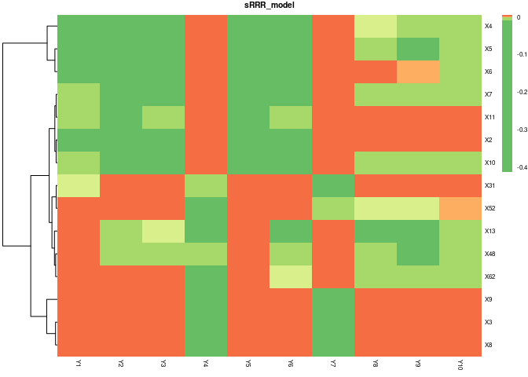<!-- -->

```r
#----#
```


### mRRR 


```r
#Matrix of outcomes (can be of mixed types and with missing values)
Y <- data.matrix(Y_scaled)

# Matrix of input predictors
X <- data.matrix(X_scaled)
X0 <- cbind(1,X)

# Prepare model
ncovar <- which(colnames(X) %in% colnames(X)[c((p+1):(p+c))])
family <- rrr.sim3(n = 100, p = 30, q.mix = c(q,0,0),nrank = 2, mis.prop = 0.2)$family
familygroup <- rep(1,ncol(Y))
svdX0d1 <- svd(X0)$d[1]
init1 = list(kappaC0 = svdX0d1 * 5)
offset = NULL
control = list(epsilon = 1e-4, sv.tol = 1e-2, maxit = 2000,
               trace = FALSE, gammaC0 = 1.1, plot.cv = FALSE,
               conv.obj = FALSE)

# Run CV mRRR model
fit.cv.mrrr <- cv.mrrr(Y, X,family = family,familygroup = familygroup,ctrl.id=ncovar,maxrank = min(nrow(X),ncol(X),ncol(Y)),
                       penstr = list(penaltySVD = "rankCon",
                                     lambdaSVD = c(1 : 6)),
                       control = control, init = init1,
                       nfold = 5, nlam = 50)
```


```r
# Optimal final model
fit.mrrr <- fit.cv.mrrr$fit

# Density plot of beta coefficients
toplot <- as.numeric(unlist(as.data.frame(coef(fit.cv.mrrr)[-1,])))
hist((y=toplot), breaks = 45)
```

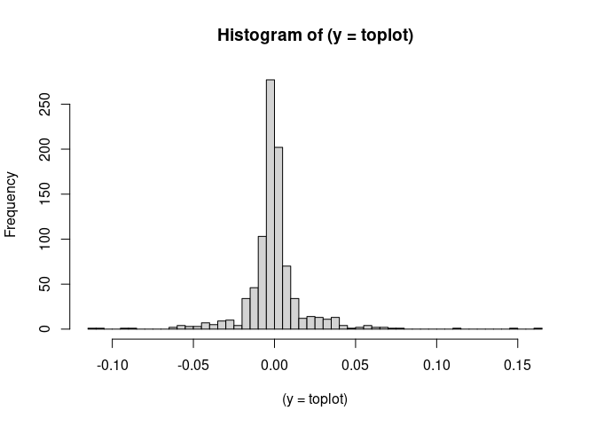<!-- -->

```r
# Selecting coefficient for non confounder variables
coef_matrix_df <- coef(fit.cv.mrrr)[-1,]
rownames(coef_matrix_df) <- colnames(X_scaled)
names(coef_matrix_df) <- colnames(Y_scaled)

# Remove confounders from output coefficient matrix
coef_matrix_df <- coef_matrix_df[-which(rownames(coef_matrix_df) %in% colnames(X_scaled)[c((p+1):(p+c))]),]
```


```r
#-- Plotting outputs: Heatmap of beta coefficients --#
# Function for identifying the breaks for generating N equal size groups of beta values
quantile_breaks <- function(xs, n = 8) {
  breaks <- quantile(xs, probs = seq(0, 1, length.out = n))
  breaks[!duplicated(breaks)]
}
mat_breaks <- quantile_breaks(coef_matrix_df, n = 6)
mat_breaks <- c(mat_breaks[c(1:3)],-0.00000000000000000000000000000000001,0.00000000000000000000000001,mat_breaks[c(4:6)])
table(cut(as.numeric(coef_matrix_df), breaks=mat_breaks))
```

```

 (-0.0604,-0.00577] (-0.00577,-0.00203]   (-0.00203,-1e-35]      (-1e-35,1e-26] 
                159                 160                 140                   0 
   (1e-26,0.000311]  (0.000311,0.00441]    (0.00441,0.0711] 
                 20                 160                 160 
```

```r
# Select exposures with a beta coefficient above the 50 percentile in at least 60 % of the outcomes
getPercBeta <- function (x,p) { 
  object <- c((as.numeric(quantile(abs(x[which(x<0)]),c(p)))*-1),as.numeric(quantile(x[which(x>0)],c(p))))
  return(object)
}
THRESHOLD_BETA <- apply(coef_matrix_df,2,getPercBeta,0.50)
THRESHOLD_BETA_Pmean <- apply(THRESHOLD_BETA,1,mean)
check_betas <- function (x) {
  (length(which((x > THRESHOLD_BETA_Pmean[2]) | (x < THRESHOLD_BETA_Pmean[1])))*100)/ncol(coef_matrix_df) > 60
}
sel_exp <- names(which(apply(coef_matrix_df,1,check_betas)))
mRRRmodel_filter <- coef_matrix_df[sel_exp,]
# Heatmap
pheatmap(mRRRmodel_filter, fontsize = 6, fontsize_row = 6, cluster_rows = T, cluster_cols = F, border_color=NA,color = rev(brewer.pal(11, "RdYlGn")[c(3:9)]),breaks = mat_breaks, main="mRRR_model")
```

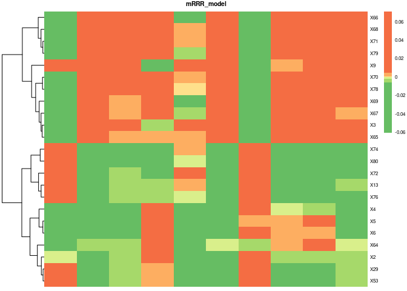<!-- -->

```r
#----#
```


### MBSP


```r
# Create a different object for confounders
C <- X_scaled[,c((p+1):(p+c))]

# Matrix of exposures
X <- X_scaled[,-c((p+1):(p+c))]
```


```r
#------------ Model selection ------------# If the process is running low, you can run "mbsp_model_1" and go directly to line 596 to continue with optimal model
#
# The user will need to specify the argument "model_criteria=TRUE" when running MBSP() function 
# This makes the code slower but allows you to compare different model fits.

#-------- HORSESHOES PRIOR u=0.5, a=0.5
#-- Try tau=1e-8 (very small: 10^{-8})
mbsp_model_1 <- MBSP(Y=Y_scaled,X=X,confounders=C, u=0.5, a=0.5, tau=1e-8, model_criteria=TRUE) # variables selected by the MBSP model with horseshoes prior and when tau is very small
#-- Try tau=1e4 (very large: 10^4)
mbsp_model_2 <- MBSP(Y=Y_scaled,X=X,confounders=C, u=0.5, a=0.5, tau=1e4, model_criteria=TRUE) # variables selected by the MBSP model with horseshoes prior and when tau is very large

#-------- NEG priors u=1, a=0.1
#-- Try tau=1e-8 (very small: 10^{-8})
mbsp_model_3 <- MBSP(Y=Y_scaled,X=X,confounders=C, u=1, a=0.1, tau=1e-8, model_criteria=TRUE)  variables selected by the MBSP model with NEG prior and when tau is very small
#-- Try tau=1e4 (very large: 10^4)
mbsp_model_4 <- MBSP(Y=Y_scaled,X=X,confounders=C, u=1, a=0.1, tau=1e4, model_criteria=TRUE) # variables selected by the MBSP model with NEG prior and  when tau is very large

#-------- Strawderman-berger priors (u=1, a=0.5)
#-- Try tau=1e-8 (very small: 10^{-8})
mbsp_model_5 <- MBSP(Y=Y_scaled,X=X,confounders=C, u=1, a=0.5, tau=1e-8, model_criteria=TRUE) # variables selected by the MBSP model with trawderman-berger priors and when tau is very small
#-- Try tau=1e4 (very large: 10^4)
mbsp_model_6 <- MBSP(Y=Y_scaled,X=X,confounders=C, u=1, a=0.5, tau=1e4, model_criteria=TRUE) # variables selected by the MBSP model with trawderman-berger priors and when tau is very large

#-------- Use 'default' tau of tau=1/(p*sqrt(n*log(n)) but change u and a
# Corresponds to NEG prior tau=1/(p*sqrt(n*log(n)) but change u and a
mbsp_model_7 <- MBSP(Y=Y_scaled,X=X,confounders=C, u=1, a=0.1, model_criteria=TRUE) # Gives a less sparse model, due to NEG having lighter tails. 
# Corresponds to horseshoe prior with default tau=1/(p*sqrt(n*log(n))
mbsp_model_8 <- MBSP(Y=Y_scaled,X=X,confounders=C, u=0.5, a=0.5, model_criteria=TRUE)
# Corresponds to Strawderman-berger prior (u=1, a=0.5)  with default tau=1/(p*sqrt(n*log(n))
mbsp_model_9 <- MBSP(Y=Y_scaled,X=X,confounders=C, u=1, a=0.5, model_criteria=TRUE)

# Compare all models' DIC's
mbsp_model_1$DIC # HORSESHOES PRIOR u=0.5, a=0.5  (very small: 10^{-8})
mbsp_model_2$DIC # HORSESHOES PRIOR u=0.5, a=0.5 (very large: 10^4)
mbsp_model_3$DIC # NEG prior u=1, a=0.1  (very small: 10^{-8})
mbsp_model_4$DIC # NEG prior u=1, a=0.1 (very large: 10^4)
mbsp_model_5$DIC # Strawderman-berger prior (u=1, a=0.5)  (very small: 10^{-8})
mbsp_model_6$DIC # Strawderman-berger prior (u=1, a=0.5) (very large: 10^4)
mbsp_model_7$DIC # NEG prior tau=1/(p*sqrt(n*log(n)) 
mbsp_model_8$DIC # horseshoe prior with default tau=1/(p*sqrt(n*log(n))
mbsp_model_9$DIC # Strawderman-berger prior (u=1, a=0.5)  with default tau=1/(p*sqrt(n*log(n))
# Compare all models' WAIC's
mbsp_model_1$WAIC # HORSESHOES PRIOR u=0.5, a=0.5  (very small: 10^{-8})
mbsp_model_2$WAIC # HORSESHOES PRIOR u=0.5, a=0.5 (very large: 10^4)
mbsp_model_3$WAIC # NEG prior u=1, a=0.1  (very small: 10^{-8})
mbsp_model_4$WAIC # NEG prior u=1, a=0.1 (very large: 10^4)
mbsp_model_5$WAIC # Strawderman-berger prior (u=1, a=0.5)  (very small: 10^{-8})
mbsp_model_6$WAIC # Strawderman-berger prior (u=1, a=0.5) (very large: 10^4)
mbsp_model_7$WAIC # NEG prior tau=1/(p*sqrt(n*log(n)) 
mbsp_model_8$WAIC # horseshoe prior with default tau=1/(p*sqrt(n*log(n))
mbsp_model_9$WAIC # Strawderman-berger prior (u=1, a=0.5)  with default tau=1/(p*sqrt(n*log(n))
#------------ ------------#
```


```r
# Selection of optimal model
mbsp.model <- MBSP(Y=Y_scaled,X=X,confounders=C, u=0.5, a=0.5, tau=1e-8, model_criteria=TRUE) # NOTE: Insert here the optimal model from the chunk above!!!!
```

```
Iteration: 1000 
Iteration: 2000 
Iteration: 3000 
Iteration: 4000 
Iteration: 5000 
Iteration: 6000 
```

```r
# Obtain confidence intervals
productCI <- mbsp.model$B_CI_lower * mbsp.model$B_CI_upper

# Display the active predictors (correspond to row indices in B)
colnames(X)[mbsp.model$active_predictors]
```

```
[1] "X3" "X4" "X5" "X6" "X8" "X9"
```

```r
list_active_pred <- which(apply((!productCI<0),1,any))
for (i in list_active_pred)
{
  cols_active_pred <- which(!productCI[i,] < 0)
  mbsp.model$B_est[i,cols_active_pred] <- 0
}

# Set to zero the coefficients of non selected predictors according to CIs
mbsp.model$B_est[-list_active_pred,] <- matrix(0,dim(mbsp.model$B_est[-list_active_pred,])[1],dim(mbsp.model$B_est[-list_active_pred,])[2])
rownames(mbsp.model$B_est) <- colnames(X)
colnames(mbsp.model$B_est) <- colnames(Y_scaled)

# Density plot of beta coefficients
toplot <- as.numeric(unlist(as.data.frame(mbsp.model$B_est)))
hist((y=toplot), breaks = 45)
```

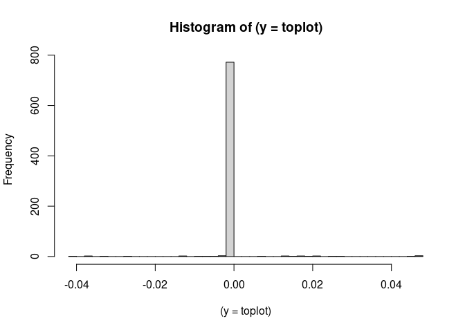<!-- -->


```r
#-- Plotting outputs: Heatmap of beta coefficients --#
# Function for identifying the breaks for generating N equal size groups of beta values
quantile_breaks <- function(xs, n = 8) {
  breaks <- quantile(xs, probs = seq(0, 1, length.out = n))
  breaks[!duplicated(breaks)]
}
mat_breaks_neg <- quantile_breaks(mbsp.model$B_est[which(mbsp.model$B_est<0)], n = 3)
mat_breaks_pos <- quantile_breaks(mbsp.model$B_est[which(mbsp.model$B_est>0)], n = 3)
mat_breaks <- c(mat_breaks_neg,-0.00000000000000000000001,0.00000000000000000000001,mat_breaks_pos)
table(cut(as.numeric(mbsp.model$B_est), breaks=mat_breaks))
```

```

   (-0.042,-0.0104] (-0.0104,-0.000102]  (-0.000102,-1e-23]      (-1e-23,1e-23] 
                  6                   7                   0                 771 
    (1e-23,0.00779]     (0.00779,0.021]      (0.021,0.0475] 
                  1                   7                   7 
```

```r
# Keep only selected predictors
sel_exp <- rownames(mbsp.model$B_est)[list_active_pred]
mbsp.model_filter <- mbsp.model$B_est[sel_exp,]
# Heatmap
pheatmap(mbsp.model_filter, fontsize = 6, fontsize_row = 6, cluster_rows = T, cluster_cols = F, border_color=NA,color = rev(brewer.pal(11, "RdYlGn")[c(3:9)]),breaks = mat_breaks, main="MBSP_model")
```

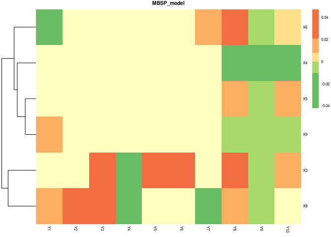<!-- -->

```r
#----#
```


### ExWAS


```r
# Load predictors and outcomes
dataX <- as.data.frame(X_scaled)
dataY <- as.data.frame(Y_scaled)
familygroup <- rep("gaussian",ncol(dataY))
data <- as.data.frame(cbind(dataX,dataY))

# Run ExWAS model for each outcome
lmoutput <- list()
for (i in 1:ncol(dataY)) {
  print(colnames(dataY)[i])
    lmoutput[[i]] <- data %>%
      dplyr::select(-c(colnames(dataY),colnames(dataX)[c((p+1):(p+c))])) %>%
      map(~lm(as.formula(paste(colnames(dataY)[i]," ~ ",paste(colnames(dataX)[c((p+1):(p+c))],collapse=" + "),"+ .x")), data = data)) %>%
      map(summary)
    names(lmoutput)[i] <-colnames(dataY)[i]
 }
```

```
[1] "Y1"
[1] "Y2"
[1] "Y3"
[1] "Y4"
[1] "Y5"
[1] "Y6"
[1] "Y7"
[1] "Y8"
[1] "Y9"
[1] "Y10"
```

```r
# Extract matrix of coefficients and P-values
extractbeta <- function(x) {
  zfun <- function (z) {
    return(coefficients(z)[nrow(coefficients(z)),1])
  }
  return(  as.numeric(lapply(x,zfun)) )
}
extractpval <- function(x) {
  yfun <- function (y) {
    return(coefficients(y)[nrow(coefficients(y)),4])
  }
  return(  as.numeric(lapply(x,yfun)) )
}
coefm <- as.data.frame(do.call(cbind, lapply(lmoutput,extractbeta)))
rownames(coefm) <- names(lmoutput[[1]])
pvalm <- as.data.frame(do.call(cbind, lapply(lmoutput,extractpval)))
rownames(pvalm) <- names(lmoutput[[1]])
pvalm_adj <- as.data.frame(matrix(p.adjust(as.vector(as.matrix(pvalm)), method='fdr'),ncol=ncol(dataY)))
rownames(pvalm_adj) <- rownames(pvalm)
names(pvalm_adj) <- names(pvalm)

# Select only significant exposures according to adjusted P-value
coefm_adj_f <- as.matrix(coefm)
coefm_adj_f[which(pvalm_adj > 0.05)] <- 0
```


```r
#-- Plotting outputs: Heatmap of beta coefficients --#
# Select only exposures showing significant P-value in at least two outcomes
coefmatrix_toplot <- coefm_adj_f[which(apply(coefm_adj_f,1,function(x){ length(which( x != 0 )) >= 2 })),]
# Function for identifying the breaks for generating N equal size groups of beta values
quantile_breaks <- function(xs, n = 8) {
  breaks <- quantile(xs, probs = seq(0, 1, length.out = n))
  breaks[!duplicated(breaks)]
}
mat_breaks_neg <- quantile_breaks(coefmatrix_toplot[which(coefmatrix_toplot<0)], n = 3)
mat_breaks_pos <- quantile_breaks(coefmatrix_toplot[which(coefmatrix_toplot>0)], n = 3)
mat_breaks <- c(mat_breaks_neg,-0.000000000000000000000001,0.000000000000000000000001,mat_breaks_pos)
mat_breaks
```

```
           0%           50%          100%                             
-5.192842e-01 -1.031527e-01 -7.166465e-02 -1.000000e-24  1.000000e-24 
           0%           50%          100% 
 7.454580e-02  1.018990e-01  2.849184e-01 
```

```r
table(coefmatrix_toplot==0)
```

```

FALSE  TRUE 
   56   154 
```

```r
table(cut(as.numeric(coefmatrix_toplot), breaks=mat_breaks))
```

```

 (-0.519,-0.103] (-0.103,-0.0717] (-0.0717,-1e-24]   (-1e-24,1e-24] 
              20               21                0              154 
  (1e-24,0.0745]   (0.0745,0.102]    (0.102,0.285] 
               1                6                7 
```

```r
# Heatmap
pheatmap(coefmatrix_toplot, fontsize = 6, fontsize_row = 6, cluster_rows = T, cluster_cols = F, border_color=NA,color = rev(brewer.pal(11, "RdYlGn")[c(3:9)]),breaks = mat_breaks, main="ExWAS_model")
```

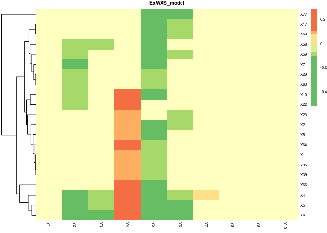<!-- -->

```r
#----#
```


